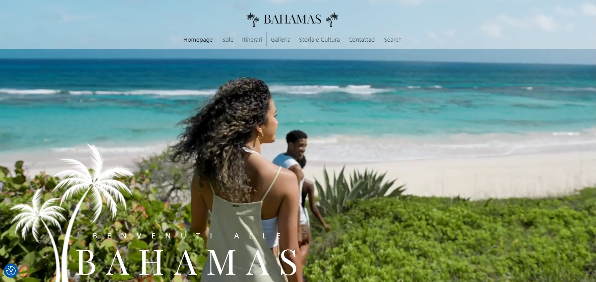
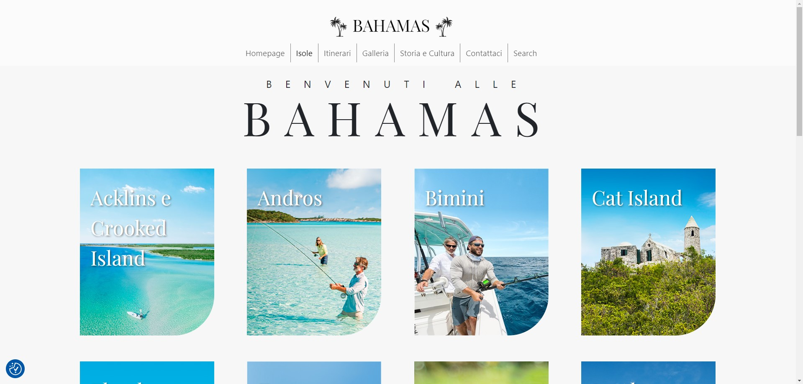
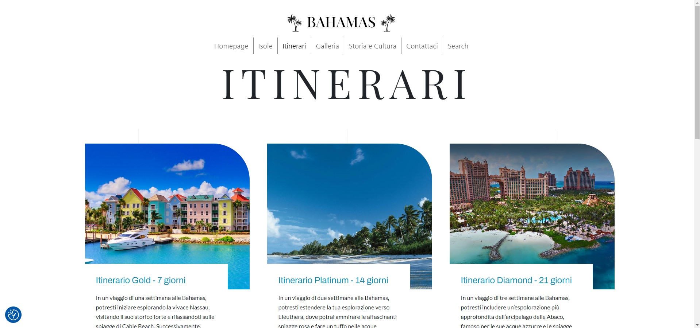

<h1>Custom WordPress Theme per le Bahamas</h1>

    
Benvenuti nel Custom WordPress Theme dedicato alle Bahamas! Questo tema è stato progettato e sviluppato per fornire un'esperienza unica e coinvolgente per i siti web che rappresentano le bellezze e le attrazioni delle Bahamas.

  <h2>Caratteristiche Principali:</h2>
    <ul>
        <li><strong>Design Esclusivo:</strong> Il tema presenta un design esclusivo e accattivante ispirato alla vibrante cultura e alla bellezza naturale delle Bahamas. Colori vivaci, immagini mozzafiato e un layout intuitivo cattureranno l'attenzione dei visitatori e li immergeranno nell'atmosfera delle isole.</li>
        <li><strong>Personalizzazione Flessibile:</strong> Il tema è altamente personalizzabile, consentendo agli utenti di adattarlo alle proprie esigenze e preferenze. Dalle opzioni di personalizzazione del logo e dei colori al layout delle pagine e alla tipografia, hai il controllo completo sull'aspetto e sullo stile del tuo sito.</li>
        <li><strong>Galleria Multimediale:</strong> Con la galleria multimediale integrata, puoi facilmente condividere foto e video mozzafiato delle Bahamas. Mostra le spiagge sabbiose, i tramonti spettacolari, la ricca vita marina e altre attrazioni mozzafiato per ispirare i visitatori a visitare le Bahamas.</li>
        <li><strong>Prenotazioni e Piani di Viaggio:</strong> Integra facilmente moduli di prenotazione e pianificazione dei viaggi per aiutare i visitatori a pianificare il loro viaggio alle Bahamas direttamente dal tuo sito. Offri pacchetti vacanza personalizzati, prenotazioni alberghiere, tour guidati e altro ancora.</li>
        <li><strong>Eventi e Attrazioni Locali:</strong> Mantieni i tuoi visitatori aggiornati sugli eventi locali, festival, mostre d'arte, concerti e altre attrazioni nelle Bahamas. Utilizza calendari degli eventi interattivi e schede informative per fornire dettagli e promuovere esperienze uniche nell'arcipelago.</li>
    </ul>

  

  
Scopri le meraviglie delle Bahamas con il nostro Custom WordPress Theme e trasforma il tuo sito web in una vetrina affascinante e invitante per questa splendida destinazione!

  

  
Creato con passione da <a href="https://www.linkedin.com/in/trixiamarielorenzana/" target="_blank">Trixia Marie Lorenzana</a>, <a href="https://www.linkedin.com/in/gregorio-vecchio-b709232b0/" target="_blank">Gregorio Vecchio</a>, <a href="https://www.linkedin.com/in/anna-cerasoli-85a11923b/" target="_blank">Anna Cerasoli</a>, <a href="https://www.linkedin.com/in/lavinia-baratti/" target="_blank">Lavinia Baratti</a>, <a href="https://www.linkedin.com/in/marcopetruzzella00/" target="_blank">Marco Petruzzella</a>, <a href="https://www.linkedin.com/in/manuel-graziani-juniorfullstack/" target="_blank">Manuel Graziani</a> e <a href="https://www.linkedin.com/in/monica-misciagna-1b83651ba/" target="_blank">Monica Misciagnia</a>

  
Ispirato al Sito Ufficiale delle Bahamas, immagini e video sono stati utilizzati a scopo didattico

